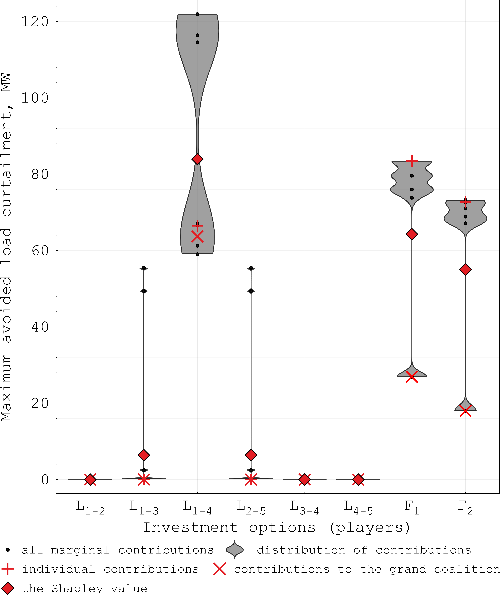
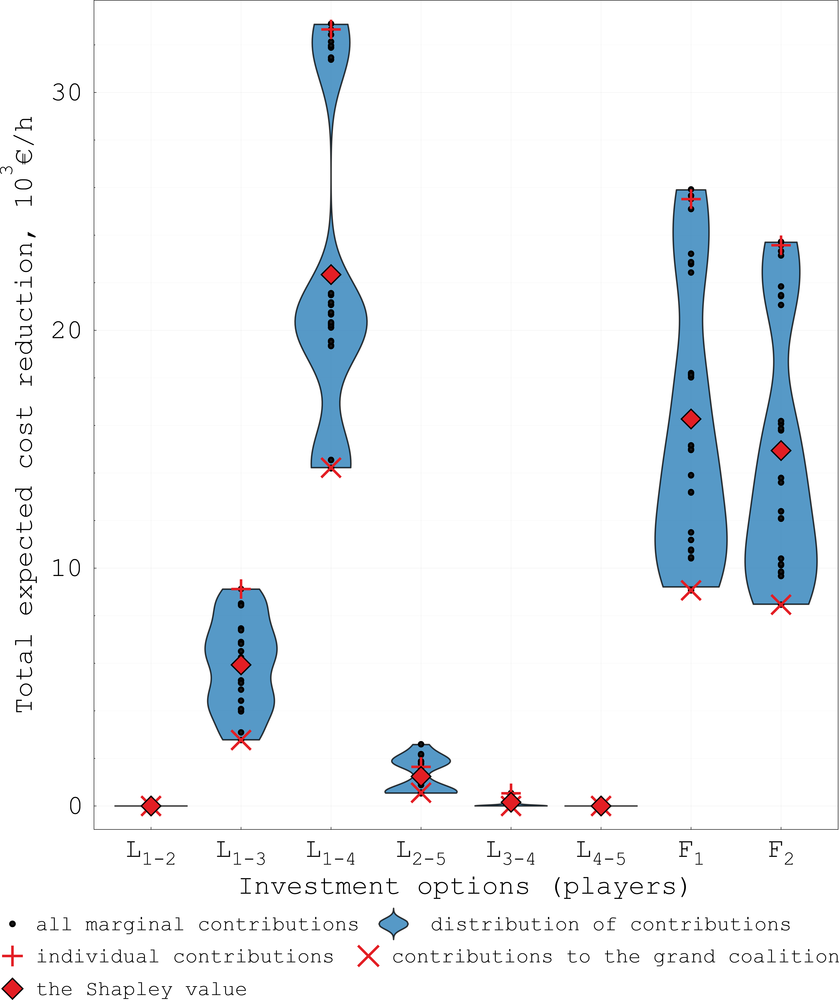

# iSCTEP
Interpretable Security-Constrained Transmission Expansion Planning

    
    

### REFERENCES:
[1] M. I. Alizadeh, M. Usman, and F. Capitanescu, “Envisioning security control in renewable dominated power systems through stochastic multiperiod AC security constrained optimal power flow,” International Journal of Electrical Power & Energy Systems, vol. 139, 2022
