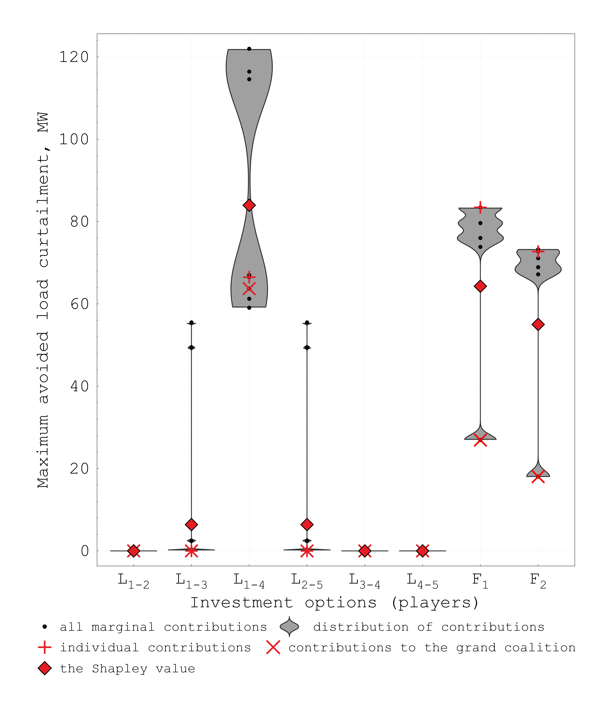

# iSCTEP
**Interpretable Security-Constrained Transmission Expansion Planning**

This repository contains **i-SCTEP**, a tool for N-1 secure network planning that enables interpreting the value of flexibility (e.g., from energy storage systems) in terms of contributions to avoided load curtailment and total expected system cost reduction. Inspired by cooperative game theory, the tool ranks the contributions of flexibility providers and compares them against traditional line reinforcements. Specifically, the tool formulates a cooperative game among selected investment options (line reinforcements and flexibility providers) and iteratively solves a planning model to estimate the value of investments in different coalitions (combinations of investments). This information can be used by system planners to prioritise investments with higher contributions and synergistic capabilities.

At the core of **i-SCTEP** lies a nonlinear stochastic security-constrained optimal power model developed by Mohammad Iman Alizadeh and Florin Capitanescu (Luxembourg Institute of Science and Technology) [1]. This model was improved and extended by Andrey Churkin (The University of Manchester) to include the coalitional analysis of investment options [2].

### MOTIVATING EXAMPLE:

To illustrate the principles of flexibility valuation in N-1 secure network planning, the tool is applied to a simple 5-bus system with 6 lines, 3 generators, two loads and one wind farm [1]. A single-line diagram of the system is presented below:

A set of 6 contingencies is considered, corresponding to the tripping of every line. The case is designed in a way that some of the post-contingency states will lead to load load curtailment.
To avoid potential load curtailment, it is necessary to upgrade the system and solve the security-constrained planning problem. It is assumed that the system planner has the following investment options: 1) each line can be reinforced by a maximum additional capacity of 100 MVA, 2) flexibility (e.g., energy storage systems) can be built at bus 1 and bus 2, with a maximum capacity of 100 MW.

Using traditional network planning models, the system planner can find a single optimal solution, e.g., a cost-minimising investment portfolio. However, a single solution is not sufficient to interpret the value of flexibility in the considered planning problem. To deal with planning uncertainties, the system planner needs to prioritise the investment options and address the following questions before accepting the optimal expansion plan. How do flexibility providers contribute to avoiding potential load curtailment and reducing the total expected system cost? How effective are flexibility investments compared to line reinforcement? Which investment options jointly contribute to the defined objectives and thus have the highest synergistic capabilities in SCTEP? 

To address these questions and provide additional information for the system planner, **i-SCTEP** tool formulates a cooperative game among the 8 investment options and estimates their contributions to 28=256 coalitions.

    
    

### RUNNING THE TOOL:

### REFERENCES:
[1] M. I. Alizadeh, M. Usman, and F. Capitanescu, “Envisioning security control in renewable dominated power systems through stochastic multiperiod AC security constrained optimal power flow,” International Journal of Electrical Power & Energy Systems, vol. 139, 2022

[2] ... reference to be added...
